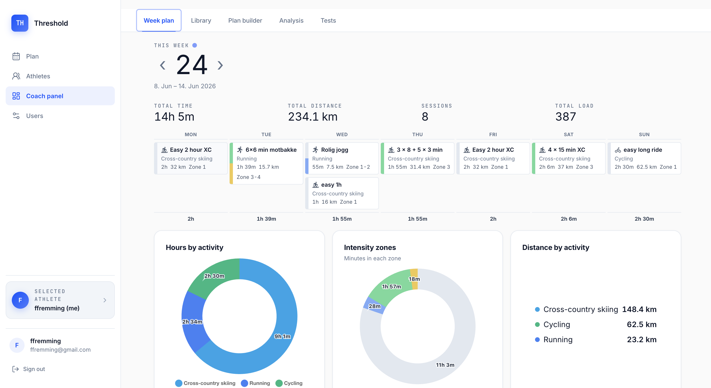
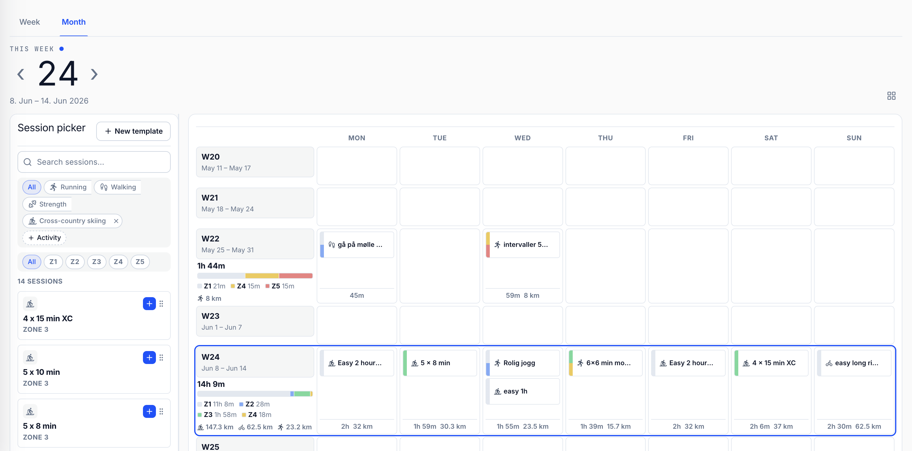
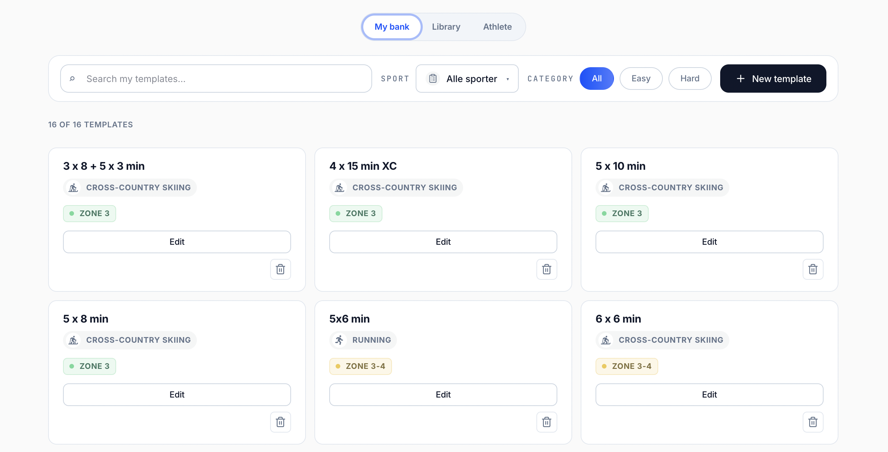
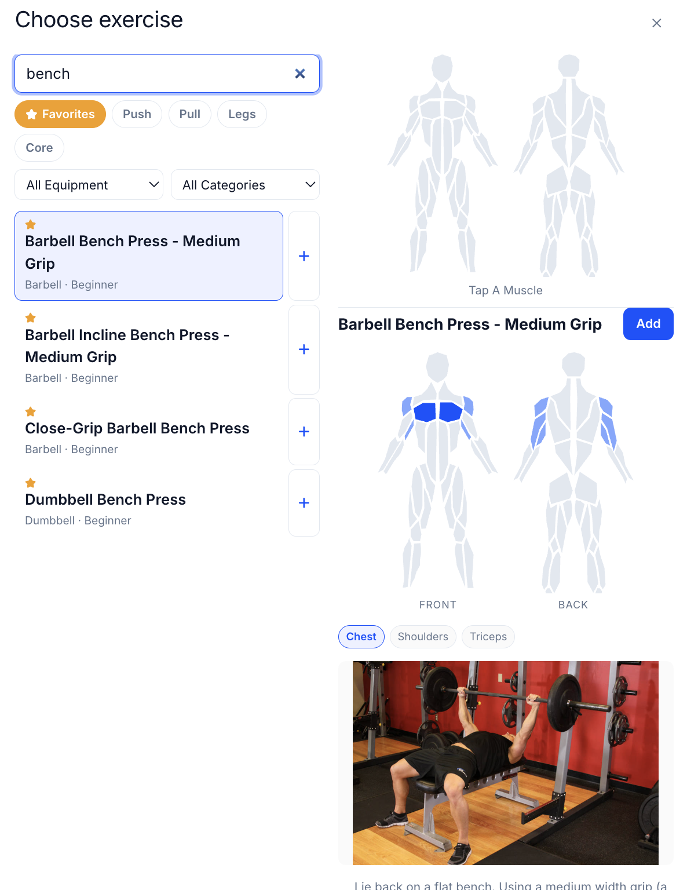

# Threshold

A training planner for coaches and athletes.

## What it solves

I've been writing training plans for myself and my girlfriend for a while. The existing options are either too rigid, too expensive, or not built for how a coach actually thinks about a week. Excel works but is miserable — there's no structure for sessions, no view of load over time, and nothing nudges you when the plan stops making sense.

Threshold gives you a session bank, a calendar you can drag plans onto, and an analysis view that surfaces load and trends without a spreadsheet. It's the tool I wanted when I was the one doing the planning.

## Features

### Coach panel — week overview

A dashboard summarising the selected athlete's week: total time, distance, sessions, and load up top, a Mon–Sun strip of planned sessions, and three breakdown charts — **Hours by activity**, **Intensity zones** (minutes in each zone), and **Distance by activity**. Switch the active athlete from the left sidebar.

### Plan builder — calendar

A drag-and-drop calendar of training weeks. The left rail is a searchable **session bank**, filterable by activity (Running, Walking, Strength, Cross-country skiing, …) and intensity zone (Z1–Z5). Drag sessions onto any day; each week row shows a rolled-up summary — total duration, a zone-distribution bar, and per-zone/per-activity totals.

### Library — templates

Reusable session templates organised across **My bank**, **Library**, and **Athlete** tabs. Search and filter by sport and category (Easy / Hard), create new templates, and edit or delete existing ones. Each card shows the sport and target zone at a glance.

### Strength sessions — exercise picker

Build strength sessions from an exercise database with search, muscle-group filters (Push / Pull / Legs / Core), equipment and category filters, and favourites. Each exercise shows the targeted muscles on front/back body diagrams plus a demonstration and step-by-step instructions.

